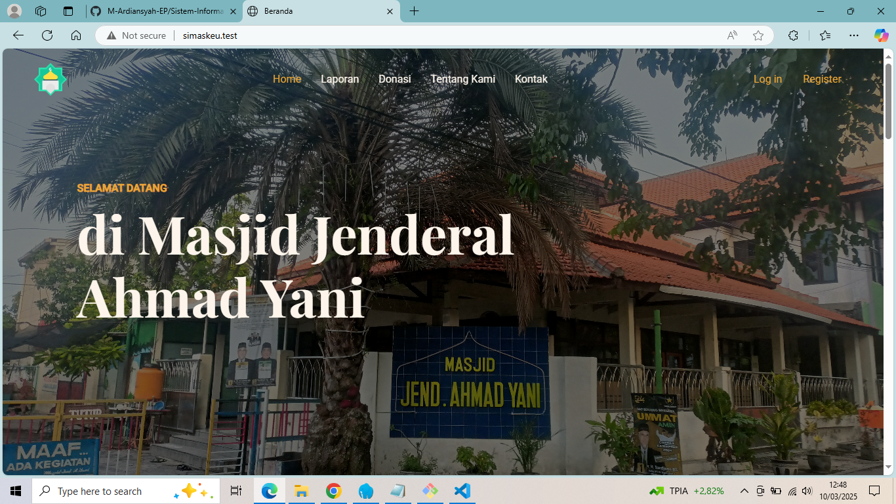
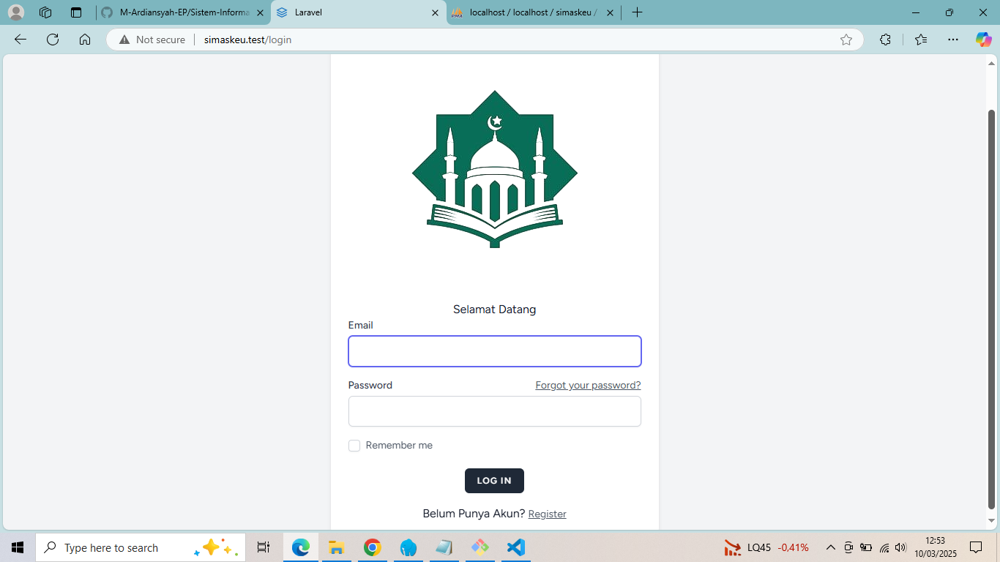
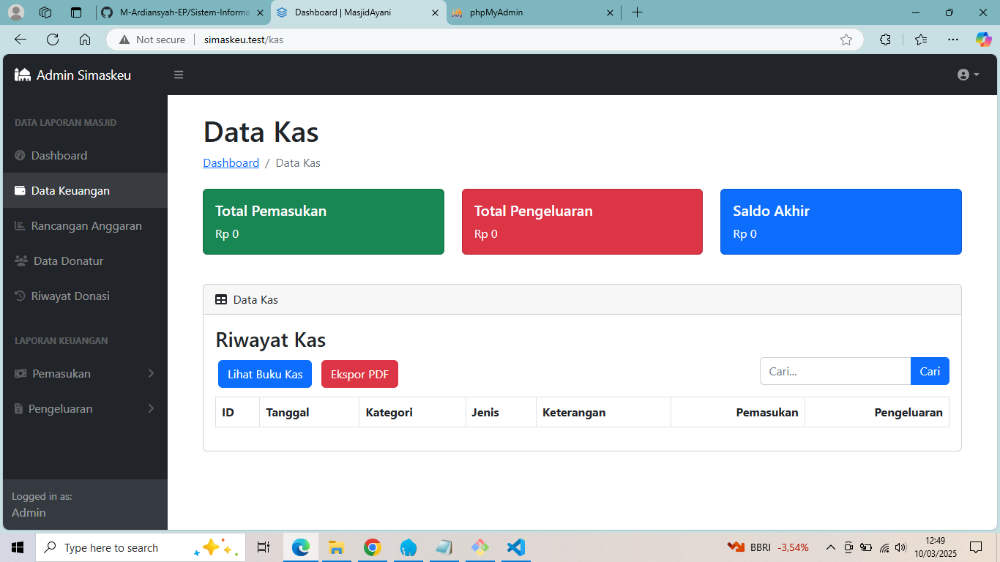
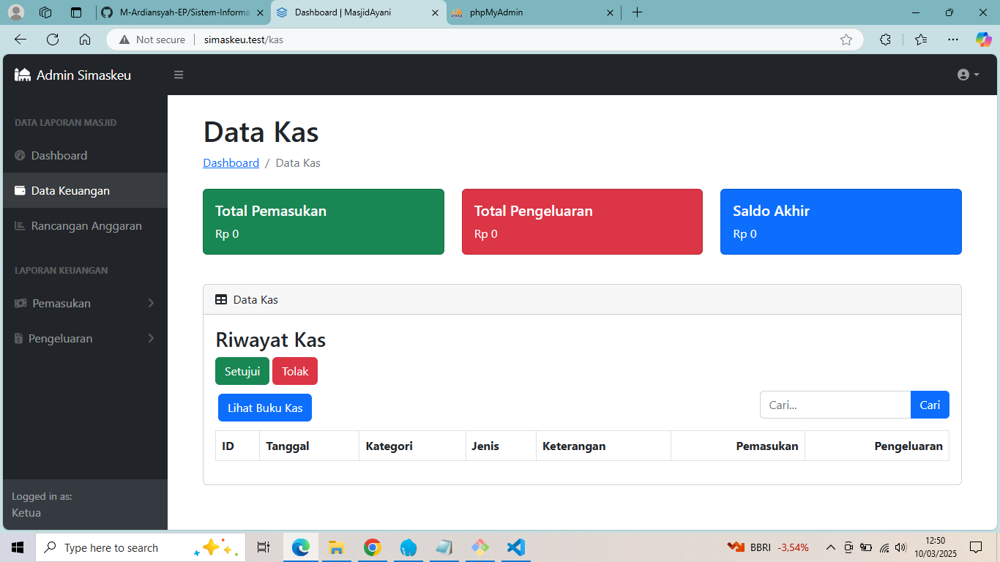
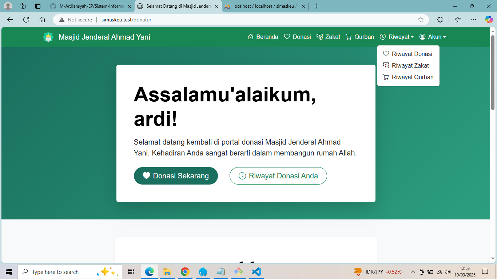
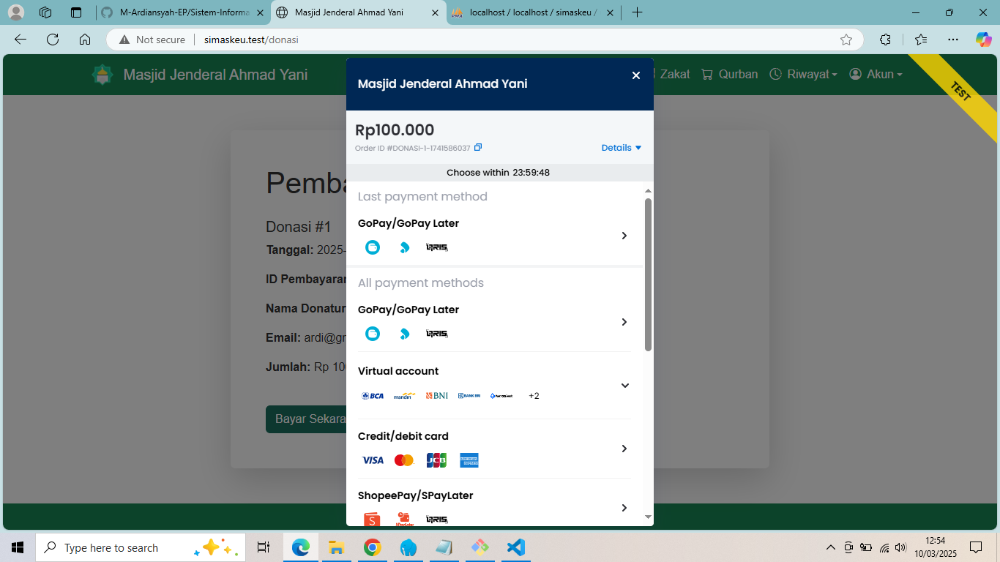

<div style="display: flex; flex-wrap: wrap; justify-content: center; gap: 20px;">
  
  
  
  
  
  
</div>

# Sistem Informasi Keuangan Masjid Jenderal Ahmad Yani

Proyek skripsi berbasis website menggunakan Laravel 11 ini merupakan sistem informasi keuangan untuk Masjid Jenderal Ahmad Yani. Aplikasi ini memiliki tiga user utama:
- **Bendahara (Admin):** Mengelola data keuangan.
- **Ketua:** Memverifikasi data keuangan.
- **Jamaah:** Dapat mendaftar sebagai donatur dan melihat laporan keuangan.

## Fitur Utama
- Manajemen data keuangan oleh bendahara.
- Verifikasi data keuangan oleh ketua.
- Pendaftaran donatur dan akses laporan keuangan bagi jamaah.

## Persyaratan
- PHP 8.0 atau lebih tinggi (rekomendasi: PHP 8.1 atau 8.2)
- Composer
- Laravel 11
- MySQL atau database lain yang didukung Laravel
- Node.js dan npm (untuk compile asset front-end, jika diperlukan)

## Langkah-langkah Instalasi dan Setup Proyek

1. **Clone Repository**  
   Clone repository dengan perintah:
   ```bash
   git clone https://github.com/M-Ardiansyah-EP/Sistem-Informasi-Keuangan-Masjid.git
   ```

2. **Masuk ke Direktori Proyek**  
   Pindah ke folder proyek:
   ```bash
   cd Sistem-Informasi-Keuangan-Masjid
   ```

3. **Install Dependensi PHP**  
   Instal semua dependensi menggunakan Composer:
   ```bash
   composer install
   ```

4. **Setup Environment**  
   Salin file `.env.example` ke `.env`:
   ```bash
   cp .env.example .env
   ```
   Kemudian, buka file `.env` dan atur konfigurasi database serta variabel lainnya sesuai kebutuhan.

5. **Generate Application Key**  
   Jalankan perintah:
   ```bash
   php artisan key:generate
   ```

6. **Jalankan Migrasi dan Seed Database**  
   Untuk membuat tabel dan memasukkan data default (roles dan users), jalankan:
   ```bash
   php artisan migrate --seed
   ```
   Seeder `RolesTableSeeder.php` dan `UsersTableSeeder.php` akan membuat:
   - **User Admin (Bendahara):**  
     Email: `admin@gmail.com`  
     Password: `12345678`
   - **User Ketua:**  
     Email: `ketua@gmail.com`  
     Password: `12345678`

7. **(Opsional) Install Dependensi Node.js dan Compile Assets**  
   Jika proyek menggunakan asset front-end, jalankan:
   ```bash
   npm install
   npm run dev
   ```

8. **Jalankan Server Pengembangan**  
   Mulai server Laravel dengan perintah:
   ```bash
   php artisan serve
   ```
   Akses aplikasi melalui [http://localhost:8000](http://localhost:8000).

## Kontribusi
Kontribusi sangat diterima! Silakan fork repository ini dan ajukan pull request untuk perbaikan atau fitur tambahan.

## Lisensi
Proyek ini dilisensikan di bawah [MIT License](https://opensource.org/licenses/MIT).
```
